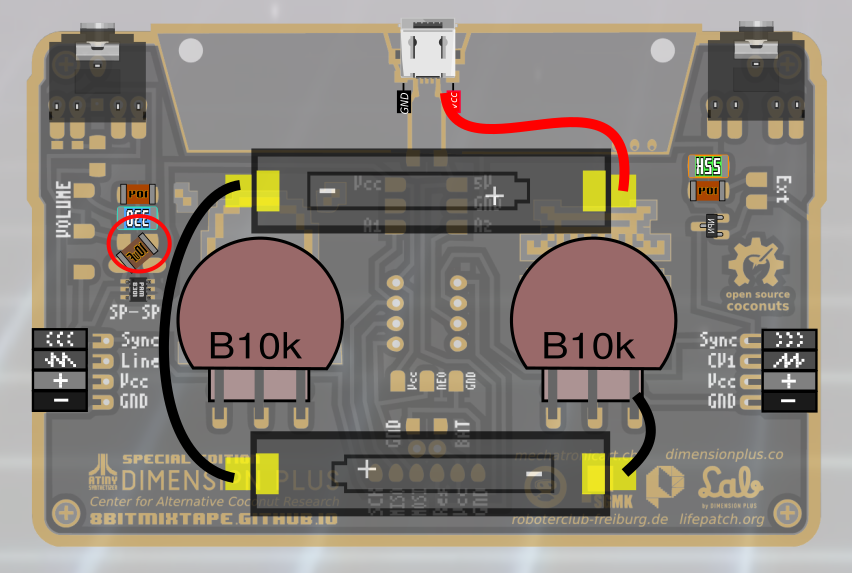
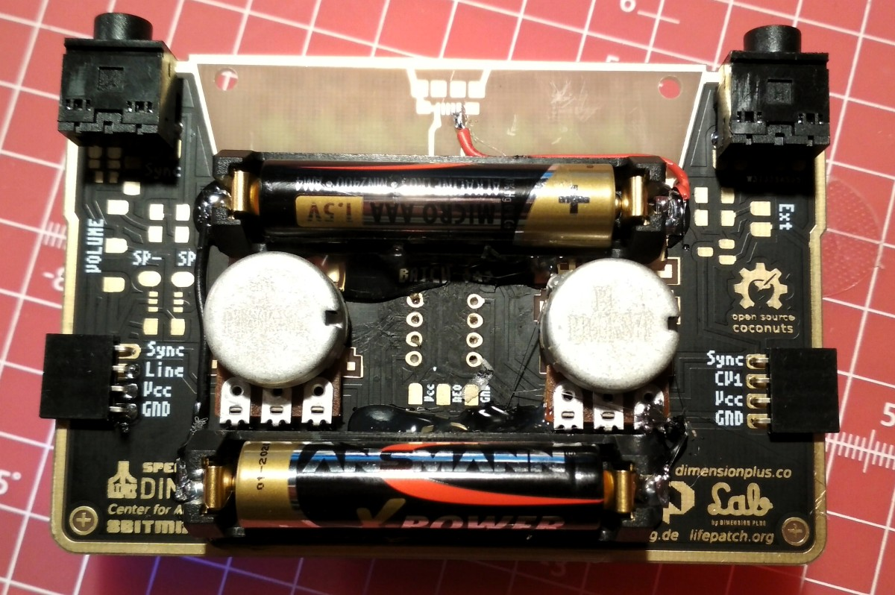

# Parts Placement

](images/soldering_instructions/8BitMixtapeNEO_PartsPlacement_front_v05.png)

Download printable [8BitMixtapeNEO_PartsPlacement](https://github.com/8BitMixtape/8BitmixtapeNEO_ShenzhenReady/blob/master/8BitMixtapeNEO_PartsPlacement_V05.pdf)

# SMD parts
### Frontside

| Part            | Value    | SMD-Code   | Amount |
| ----------------|----------|------------|--------|
| R1, R2          | 4.7K     | 4701 (472  |   2    |
| R3-R6, R11, R12 | 22K      | 2202 (223  |   7    |
| R7, R8          | 330Ohm   | 3300 (331) |   2    |
| R9, R10         | 1K       | 1001 (102) |   2    |
| C1-C3           | 100nF    |            |   3    |
| C4              | 10µF     |            |   1    |
| LED1, LED2      | red/blue |            |   2    |
| NEO-Pixel       | SK6812   |            |   8    |

## Tips for SMD soldering

**IT's EASY!!!**

### Tools and Materials needed

* Soldering iron with relatively fine tip
* thin solder 0.3 - 0.5 mm
* tweezers
* that's it...

### Solder your frist Part

Always put some solder on only one of the pads where you want to solder the part. Then pick up the part with the tweezers and put it next to the final position. Reheat the solder on the first pad and move the part into the molten solder. You can still reheat and adjust the position of the part easily and several times. Then solder the other side and always make sure you can visually see the solder flowing over BOTH the pad and the part.

### Careful with the NEO-Pixels

The NEO-Pixels are maybe the most tricky part to solder. They have 4 pads to be soldered. Also try to keep the heating temperature and time as low as possible, it can damage the NEO-Pixels if they get to hot.

Again, put solder only on one pad of the 4 corners. Then reheat the solder and move the part into the right position. You can adjust it again to make sure it's straight, but remember not to overheat the part.

Then you can solder the other pads. Wait in between to let the part cool down. Make sure you place the tip of the soldering iron onto the pad itself to guarantee the heat and flow of the solder. Visually check if the solder nicely wets the pad and the solder-pad of the part.

### DONE!!

Juhhhuuuuu, you managed to solder all the parts of the "Just for Pro" kit. Now onwards to the easy bits.

# Big Parts
### Frontside
| Part            | Value    |            | Amount |
| ----------------|----------|------------|--------|
| Buttons         |          |shorten legs|   2    |
| On/Off Switch   |          |bend/cut legs|   1    |
| IC-Socket       | DIL-8    |            |   1    |
| Attiny85        |          | plug it in |   1    |

### Backside
| Part            | Value    |            | Amount |
| ----------------|----------|------------|--------|
| Potentiometer   | 10K lin  |            |   2    |
| AudioJack       | 3.5m     |  Stereo    |   2    |
| Side-Connector  | 4 Pin    |  female    |   2    |
| (external power)| 2 Pin/USB|  optional  |   1    |
| (AAA Holder)    |          |  optional  |   2    |

# Power Management

The current edition of the mixtape has several options to be powered. In the kit the version with 2 AAA battery holders is included. It has to be seperately wired on the backside and glued by hand. See the picture below on how to attach it.

## AAA Battery holders

### other options
#### External PowerPack

On the Backside there is a pad labeled "5V", solder a battery back to this pad and to GND. This bad is connected before the main power switch.

#### Using USB-wired power

Be careful, hand-soldering the USB plug can be quite tricky!

#### Using LiPo Battery

If you use a LiPo Battery also connect it to the pad labeled "5V". Small LiPo charging units are available from various cheap online sources like ali-express or ebay. Look for one that has "battery protection" to improve lifetime of your battery and inhibit complete discharge. LiPo batteries are difficult to ship and will not be included in any of our kits.